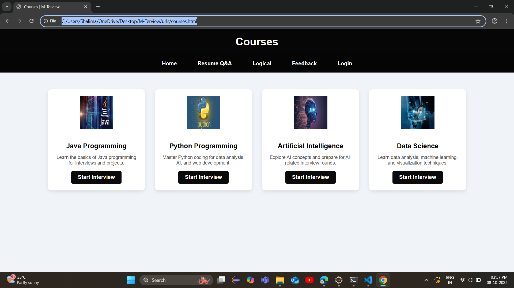
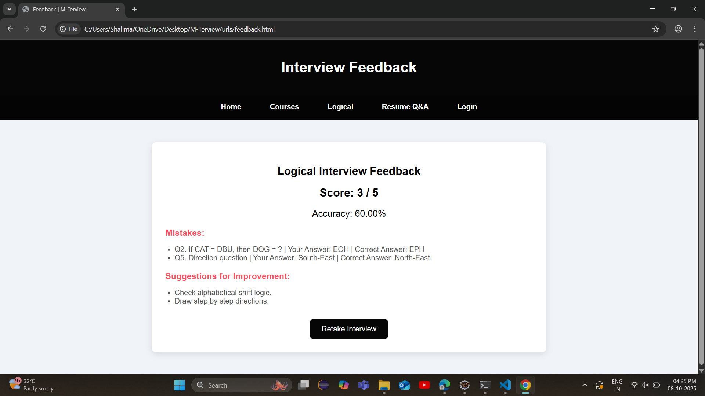
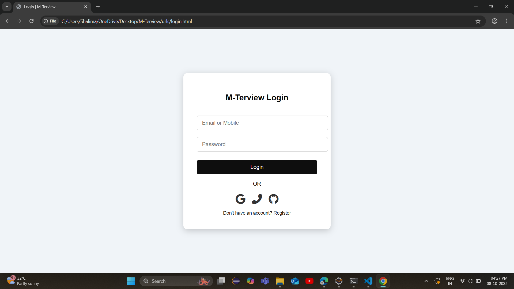

 ONLINE INTERVIEW PLATFORM - (M-Terview) |

[Live Demo]( https://mathin04.github.io/Online-Interview-Platform-/)

 PURPOSE:

"M-Terview" is an "Online Interview Practice Platform" designed for students and job seekers to improve their technical and programming skills.  
It helps users prepare for interviews in topics like "Java, Python, AI, and Data Science" in an interactive and easy-to-use environment.

 FEATURES:

- Course-wise Interview Practice: Select courses and start interview simulations.  
- Interactive UI: Responsive design suitable for both desktop and mobile devices.  
- Simple Navigation: Easy access to Home, Courses, Resume Q&A, Logical, Feedback, and Login pages.  
- Live Site: Accessible online without installation.  

 TECHNOLOGIES USED:

- HTML5 – Structure of pages  
- CSS3 – Styling and layout  
- JavaScript – Interactive functionalities  

 HOW TO USE:

1. Open the [Live Demo](https://Mathin04.github.io/Online-Interview-Platform-/) in your browser.  
2. Navigate to "Courses" and select a topic to start the interview simulation.  
3. Use the "navigation bar" to explore Resume Q&A, Logical, Feedback, and Login pages.  
4. Practice regularly to improve technical skills and interview readiness.

 ScCREENSHOTS:
 
.jpg)

.jpg)

 CONTACT / AUTHOR:

Mathin Shaik  
- GitHub: [https://github.com/Mathin04](https://github.com/Mathin04)  
- LinkedIn: https://www.linkedin.com/in/mathin-shaik-9ab843300/ 
- Email: mathinshaik2005@gmail.com  

 LIVE SITE:

[https://Mathin04.github.io/Online-Interview-Platform-/]( https://mathin04.github.io/Online-Interview-Platform-/)

